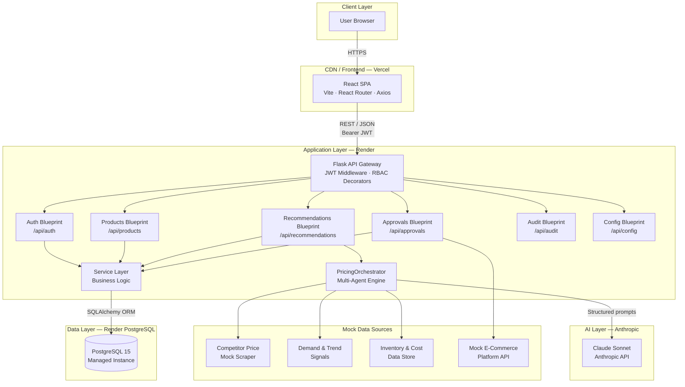
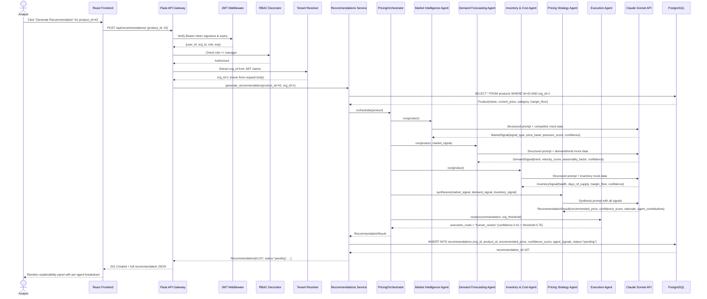
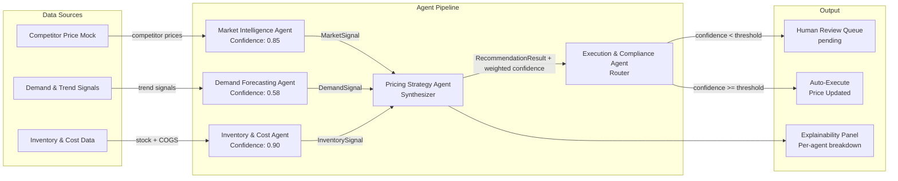
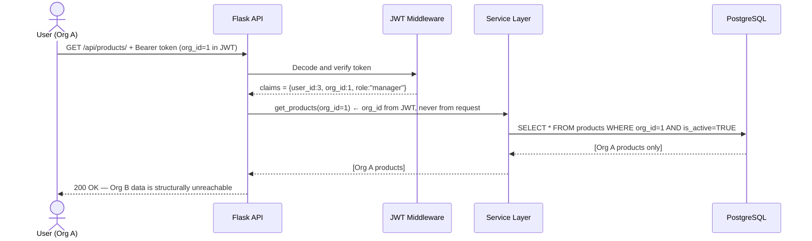
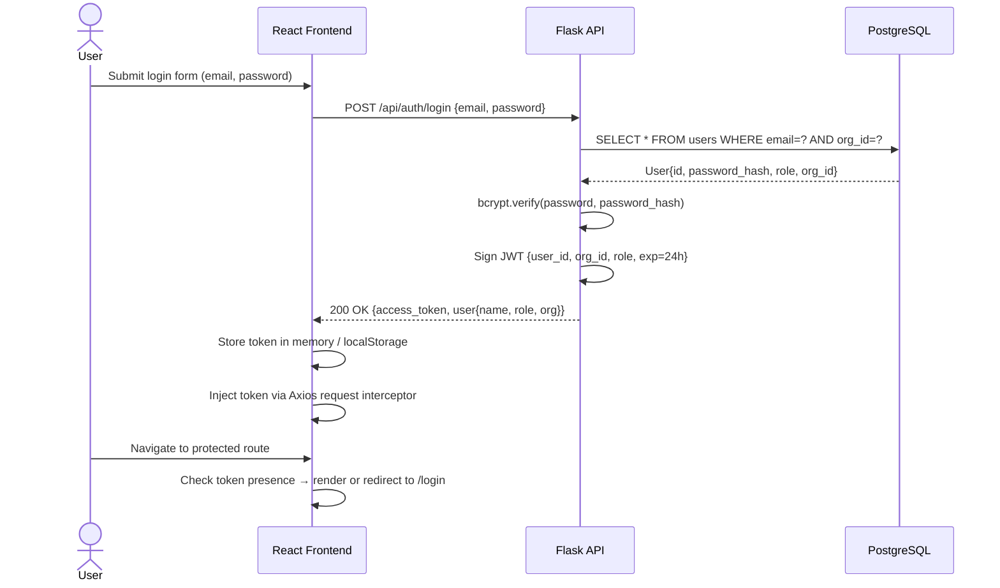
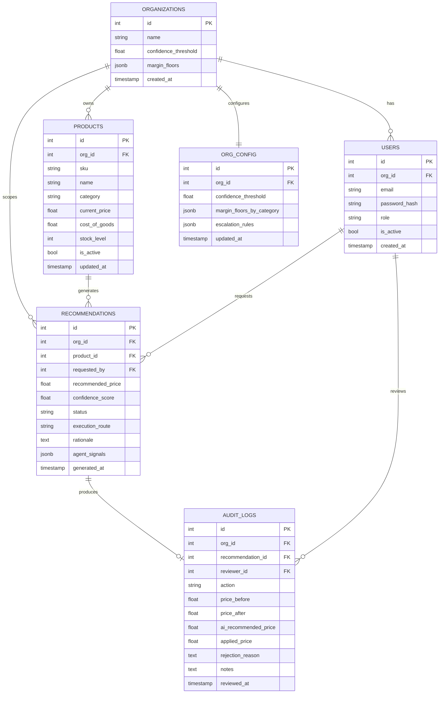
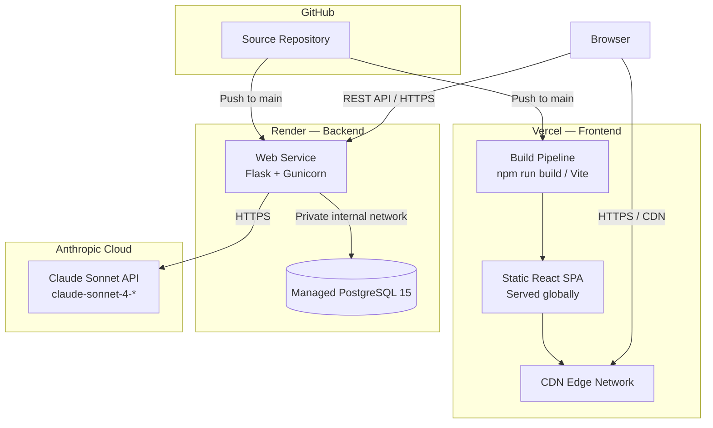
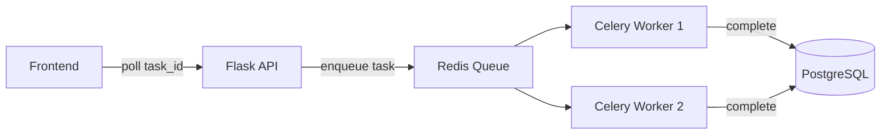

# ARCHITECTURE.md
# Dynamic Pricing Intelligence Dashboard
### Klypup Applied AI Intern Assessment — 

---

## Table of Contents

1. [System Overview](#1-system-overview)
2. [System Architecture Diagram](#2-system-architecture-diagram)
3. [Full Request Lifecycle](#3-full-request-lifecycle)
4. [Multi-Agent Architecture](#4-multi-agent-architecture)
5. [Multi-Tenant Architecture](#5-multi-tenant-architecture)
6. [Authentication & Security](#6-authentication--security)
7. [Database Architecture](#7-database-architecture)
8. [API Design](#8-api-design)
9. [Frontend Architecture](#9-frontend-architecture)
10. [Backend Architecture](#10-backend-architecture)
11. [Deployment Architecture](#11-deployment-architecture)
12. [Scalability & Future Improvements](#12-scalability--future-improvements)

---

## 1. System Overview

### Business Problem

A mid-size e-commerce company managing 500+ SKUs reprices products manually on a weekly spreadsheet cycle. The operational consequences are well-documented:

| Problem | Quantified Impact |
|---|---|
| Slow reaction to competitor price changes | 8–12% estimated revenue leakage |
| Static pricing during demand surges | Seasonal and viral opportunities uncaptured |
| Overstocked inventory with no price signal | Forced markdowns and margin erosion |
| Analysts collecting data instead of deciding | 70%+ of analyst time on non-strategic work |

### Product Goals

This platform addresses the above by delivering:

- **AI-powered pricing intelligence** — four specialized agents collaborate to surface recommendations with confidence scores and full reasoning
- **Human-in-the-loop governance** — no AI output modifies a live price without explicit human action (below the configurable confidence threshold)
- **Operational transparency** — every decision, approval, override, and rejection is logged immutably with reviewer identity and timestamps
- **Multi-tenant isolation** — organizations operate in completely isolated data spaces; Org A cannot read Org B's catalog, recommendations, or audit logs

### High-Level Architecture Summary

The platform is a three-tier, cloud-deployed SaaS application:

- **Presentation tier** — React single-page application deployed to Vercel CDN
- **Application tier** — Flask REST API deployed to Render, organized around domain-driven Blueprint modules
- **Data tier** — PostgreSQL managed database on Render, with JSONB columns for flexible AI output storage alongside a fully relational core schema

An AI orchestration layer sits inside the application tier. The `PricingOrchestrator` coordinates five specialized agents in a structured sequential pipeline, each with Pydantic-validated input/output contracts, producing a confidence-scored recommendation and rationale.

---

## 2. System Architecture Diagram

### High-Level Topology



---

## 3. Full Request Lifecycle

### Recommendation Generation — Complete Data Flow



### Approval Workflow — Manager Action

mermaid
sequenceDiagram
    actor Manager
    participant FE as React Frontend
    participant API as Flask API Gateway
    participant JWT as JWT Middleware
    participant APR as Approvals Service
    participant ECOM as Mock E-Commerce API
    participant DB as PostgreSQL

    Manager->>FE: Click "Modify & Approve" — enter price 284.99
    FE->>API: POST /api/approvals/107/modify {applied_price: 284.99, notes: "..."}
    API->>JWT: Verify token
    JWT-->>API: {user_id:5, org_id:1, role:"manager"}
    API->>APR: modify_and_approve(rec_id=107, applied_price=284.99, reviewer_id=5, org_id=1)
    APR->>DB: SELECT * FROM recommendations WHERE id=107 AND org_id=1
    DB-->>APR: Recommendation{status:"pending", recommended_price:279.99}
    APR->>ECOM: PATCH /products/42 {price: 284.99}
    ECOM-->>APR: 200 OK {ecommerce_status: "success"}
    APR->>DB: UPDATE products SET current_price=284.99 WHERE id=42 AND org_id=1
    APR->>DB: UPDATE recommendations SET status="approved" WHERE id=107
    APR->>DB: INSERT INTO audit_logs (org_id, recommendation_id, action="modified", ai_recommended_price=279.99, applied_price=284.99, reviewer_id=5, reviewed_at=now())
    DB-->>APR: audit_log_id=301
    APR-->>API: {decision:"modified", ai_recommended_price:279.99, applied_price:284.99, audit_log_id:301}
    API-->>FE: 200 OK
    FE-->>Manager: Success toast; recommendation removed from pending queue
```

---

## 4. Multi-Agent Architecture

### Agent Responsibilities

The AI engine is implemented as five specialized agents, each with a distinct domain, explicit input requirements, and a Pydantic-validated output contract. This separation enables traceable reasoning, per-agent confidence contribution, and modular replaceability.

| Agent | Domain | Inputs | Output Contract |
|---|---|---|---|
| Market Intelligence Agent | Competitor pricing, market position | Product, competitor mock data | `MarketSignal` |
| Demand Forecasting Agent | Demand elasticity, seasonal trends, SKU velocity | Product, MarketSignal, trend data | `DemandSignal` |
| Inventory & Cost Agent | Stock health, COGS, margin constraints | Product, inventory mock data | `InventorySignal` |
| Pricing Strategy Agent | Synthesis, recommendation generation | All three signals | `RecommendationResult` |
| Execution & Compliance Agent | Business rule validation, routing | RecommendationResult, org threshold | Routing decision |

### Agent I/O Contracts (Pydantic)

```python
class MarketSignal(BaseModel):
    signal_type: Literal["below_market", "at_market", "above_market"]
    price_band: tuple[float, float]
    pressure_score: float       # 0.0 = no pressure, 1.0 = extreme
    competitor_count: int
    confidence: float           # Agent-level confidence in this signal

class DemandSignal(BaseModel):
    trend: Literal["increasing", "stable", "decreasing"]
    velocity_score: float
    seasonality_factor: float
    confidence: float

class InventorySignal(BaseModel):
    health: Literal["overstocked", "healthy", "tightening", "critical"]
    days_of_supply: int
    margin_floor: float
    constraint_flag: bool
    confidence: float

class RecommendationResult(BaseModel):
    recommended_price: float
    confidence_score: float     # Weighted composite across all agents
    rationale: str              # Human-readable; displayed in the explainability panel
    agent_contributions: dict   # Stored as JSONB for per-agent UI cards
    execution_route: Literal["auto_execute", "human_review"]
```

### Composite Confidence Score

The Pricing Strategy Agent computes a weighted confidence score from all upstream agent confidences:

```
confidence_score =
    market_signal.confidence    × 0.30
  + demand_signal.confidence    × 0.35
  + inventory_signal.confidence × 0.20
  + strategy_alignment_score    × 0.15
```

The Execution Agent then routes the result:

```
confidence_score >= org.confidence_threshold  →  auto-execute (price updated immediately)
confidence_score <  org.confidence_threshold  →  human_review (enters pending queue)
```

### Multi-Agent Orchestration Flow



### Why Multi-Agent Over a Single Prompt

A single monolithic prompt could produce a pricing recommendation. The multi-agent design was chosen deliberately for three reasons:

**Traceable reasoning.** Because each agent produces a named, structured output, the explainability panel can display exactly what each agent contributed — which data source, which signal type, and what confidence it held. This is architecturally impossible with a single prompt.

**Independent confidence scoring.** Each agent holds a domain-scoped confidence value. The composite score is a principled weighted average, not a single model's self-reported certainty.

**Modular replaceability.** The Demand Forecasting Agent could be replaced with a real ML time-series model (Prophet, LSTM) without modifying any other agent. The contract — a `DemandSignal` with defined fields — is the seam.

---

## 5. Multi-Tenant Architecture

### Isolation Model

The platform uses a shared-schema, `org_id`-column isolation strategy. Every tenant-scoped table carries an `org_id` foreign key. Isolation is enforced at the service layer — not in the UI, and not by trusting client-supplied identifiers.



### Tenant Enforcement Pattern

```python
# org_id is always extracted from the verified JWT — never accepted from the client
@jwt_required()
def get_current_org_id() -> int:
    claims = get_jwt_identity()
    return claims['org_id']   # Signed by the server at login time

# Every service method receives org_id as a parameter from middleware injection
def get_products(org_id: int) -> list[Product]:
    return Product.query.filter_by(
        org_id=org_id,
        is_active=True
    ).all()
    # An Org A token cannot construct an Org B query — org_id is not user-controlled
```

Cross-tenant access is structurally impossible: `org_id` is embedded in the JWT payload, signed with the server's secret, and never accepted from any request body or query parameter.

### RBAC Permission Matrix

| Capability | admin | manager (Pricing Analyst) |
|---|:---:|:---:|
| View product catalog | ✅ | ✅ |
| Create / edit / delete products | ✅ | ✗ |
| Generate AI recommendations | ✅ | ✅ |
| View recommendation detail + explainability | ✅ | ✅ |
| Approve / reject / modify recommendations | ✅ | ✅ |
| View audit log | ✅ | ✅ |
| Configure confidence threshold & margin floors | ✅ | ✗ |
| Manage organization users | ✅ | ✗ |

RBAC is enforced by Python decorators on backend route handlers. Frontend role-gating is UI-only; the API is the authoritative enforcement layer.

---

## 6. Authentication & Security

### JWT Authentication Flow



### Security Properties

**Password storage.** Passwords are hashed with `bcrypt` (adaptive cost factor). No plaintext credentials are stored or logged.

**Token design.** JWT payload carries `user_id`, `org_id`, `role`, and `exp`. The `org_id` claim is set by the server at login — it is never accepted from user-controlled input, making token manipulation attacks ineffective without the signing secret.

**Protected routes — frontend.** React Router wrappers redirect unauthenticated users to `/login`. Role-aware wrappers hide admin-only UI paths from manager-role sessions.

**Protected routes — backend.** Flask-JWT-Extended's `@jwt_required()` decorator gates every non-public endpoint. Role checks are applied as additional decorators (`@admin_required`, `@manager_required`) before handler logic executes.

**Tenant scoping.** All database queries are parameterized and scoped to `org_id`. SQLAlchemy's ORM layer prevents raw string injection; all filter values are bound parameters.

---

## 7. Database Architecture

### Entity Relationship Diagram



### Schema Design Decisions

**JSONB for `agent_signals`.** Each recommendation stores the full per-agent output as a JSONB column. This allows the explainability panel to render dynamic agent cards without a rigid schema, while keeping the rest of the model relational and integrity-enforced.

**ACID transactions for approval actions.** The approve/modify flow — update product price, update recommendation status, write audit log — executes inside a single SQLAlchemy transaction. If any step fails, the database rolls back. PostgreSQL's ACID guarantees make this reliable without custom recovery logic.

**Soft deletes on products.** Products are flagged `is_active=False` rather than deleted, preserving referential integrity for historical recommendations and audit logs.

**`ai_recommended_price` vs `applied_price` in audit logs.** Both values are stored separately. This enables post-hoc analysis of human override patterns — how often analysts accept, modify, or reject AI recommendations — which is the foundation for future model fine-tuning and threshold calibration.

---

## 8. API Design

### Authentication

| Method | Endpoint | Auth | Description |
|---|---|---|---|
| POST | `/api/auth/register` | None | Create organization and admin user |
| POST | `/api/auth/login` | None | Authenticate; receive signed JWT |
| GET | `/api/auth/me` | Required | Current user + org context |

### Products

| Method | Endpoint | Auth | Role | Description |
|---|---|---|---|---|
| GET | `/api/products/` | Required | Any | List org products; supports filter/sort/search |
| POST | `/api/products/` | Required | Admin | Create product |
| PUT | `/api/products/:id` | Required | Admin | Update product fields |
| DELETE | `/api/products/:id` | Required | Admin | Soft-delete (sets is_active=False) |

### Recommendations

| Method | Endpoint | Auth | Role | Description |
|---|---|---|---|---|
| POST | `/api/recommendations/` | Required | Manager+ | Trigger multi-agent orchestration |
| GET | `/api/recommendations/` | Required | Any | List recommendations (scoped to org) |
| GET | `/api/recommendations/:id` | Required | Any | Full detail + per-agent explainability |

### Approvals

| Method | Endpoint | Auth | Role | Description |
|---|---|---|---|---|
| GET | `/api/approvals/pending` | Required | Manager+ | Pending review queue |
| POST | `/api/approvals/:id/approve` | Required | Manager+ | Approve at AI recommended price |
| POST | `/api/approvals/:id/reject` | Required | Manager+ | Reject; reason field required |
| POST | `/api/approvals/:id/modify` | Required | Manager+ | Override price and approve |

### Audit

| Method | Endpoint | Auth | Role | Description |
|---|---|---|---|---|
| GET | `/api/audit/` | Required | Manager+ | Full decision log; filterable by date, action, reviewer |

### Configuration (Admin Only)

| Method | Endpoint | Auth | Role | Description |
|---|---|---|---|---|
| GET | `/api/config/` | Required | Admin | Get org thresholds, margin floors, escalation rules |
| PUT | `/api/config/` | Required | Admin | Update threshold, margin floors, auto-execute rules |

### Standard Response Envelope

All responses follow a consistent JSON structure:

```json
{
  "data": { ... },
  "error": null,
  "status": 200
}
```

Error responses:

```json
{
  "data": null,
  "error": "Recommendation not found or not accessible",
  "status": 404
}
```

---

## 9. Frontend Architecture

### Routing Structure

React Router v6 is used with protected route wrappers that enforce both authentication and role-based access:

```
/                      →  redirect to /dashboard (if authed) or /login
/login                 →  LoginPage (public)
/register              →  RegisterPage (public)
/dashboard             →  DashboardHome (Protected: any role)
/products              →  ProductCatalog (Protected: any role)
/products/:id          →  ProductDetail (Protected: any role)
/recommendations/:id   →  RecommendationDetail + Explainability Panel (Protected: any role)
/approvals             →  ApprovalQueue (Protected: manager+)
/audit                 →  AuditLog (Protected: manager+)
/config                →  ConfigPanel (Protected: admin only)
```

### State Management

The application uses React's built-in state primitives. There is no global state library (Redux, Zustand) — the data-fetching pattern is component-local via `useEffect` + `useState`, with Axios handling HTTP calls.

Authentication state (JWT token, user context) is held in a React Context provider wrapping the application root, making `user`, `role`, and `org` available to all components without prop-drilling.

### API Communication

Axios is configured with a centralized instance that injects the JWT automatically via a request interceptor:

```javascript
const api = axios.create({ baseURL: import.meta.env.VITE_API_URL });

api.interceptors.request.use(config => {
    const token = localStorage.getItem('access_token');
    if (token) config.headers.Authorization = `Bearer ${token}`;
    return config;
});
```

401 responses trigger automatic logout and redirect to `/login`.

### Key UI Components

**Recommendation Cards** — display confidence score as a visual progress indicator, agent signal badges (market pressure, demand trend, inventory health), and action controls (approve / reject / modify).

**Explainability Panel** — renders one card per agent, showing signal type, data source attribution, and per-agent confidence. Built from the `agent_signals` JSONB field.

**Approval Queue** — filterable list of pending recommendations sorted by confidence score descending. Approved/rejected items are removed from the queue immediately on action to reduce operational noise.

**Audit Trail** — paginated, filterable table showing every decision with reviewer identity, timestamps, AI recommended price vs applied price, and rejection reasons.

---

## 10. Backend Architecture

### Flask Blueprint Structure

```
backend/
├── app/
│   ├── __init__.py          # App factory, Blueprint registration, JWT init
│   ├── models/
│   │   ├── user.py
│   │   ├── organization.py
│   │   ├── product.py
│   │   ├── recommendation.py
│   │   └── audit_log.py
│   ├── routes/
│   │   ├── auth.py          # Blueprint: /api/auth
│   │   ├── products.py      # Blueprint: /api/products
│   │   ├── recommendations.py # Blueprint: /api/recommendations
│   │   ├── approvals.py     # Blueprint: /api/approvals
│   │   ├── audit.py         # Blueprint: /api/audit
│   │   └── config.py        # Blueprint: /api/config
│   ├── services/
│   │   ├── auth_service.py
│   │   ├── product_service.py
│   │   ├── recommendation_service.py
│   │   └── approval_service.py
│   ├── agents/
│   │   ├── orchestrator.py          # PricingOrchestrator
│   │   ├── market_intelligence.py
│   │   ├── demand_forecasting.py
│   │   ├── inventory_cost.py
│   │   ├── pricing_strategy.py
│   │   └── execution_compliance.py
│   ├── middleware/
│   │   └── auth.py          # jwt_required, admin_required, manager_required decorators
│   └── utils/
│       ├── validators.py
│       └── mock_data.py
├── migrations/
├── seed.py
├── requirements.txt
└── .env.example
```

### Service Layer Pattern

Route handlers are thin — they validate input, extract tenant context, and delegate to the service layer. Business logic lives entirely in `services/`. The service layer receives `org_id` from middleware and is never aware of HTTP concerns.

### Orchestrator Architecture

`PricingOrchestrator` is a pure Python class that coordinates the sequential agent pipeline:

```python
class PricingOrchestrator:
    def orchestrate(self, product: Product) -> RecommendationResult:
        market_signal   = self.market_agent.run(product)
        demand_signal   = self.demand_agent.run(product, market_signal)
        inventory_signal = self.inventory_agent.run(product)
        recommendation  = self.strategy_agent.synthesize(
                              market_signal, demand_signal, inventory_signal
                          )
        routed = self.execution_agent.route(recommendation, product.org.confidence_threshold)
        return routed
```

Each agent calls the Anthropic SDK with a structured system prompt and a JSON-formatted user message. Responses are parsed and validated through Pydantic. If a Pydantic validation fails (e.g., the LLM returns a field outside the expected literal set), the agent catches the error and returns a low-confidence fallback signal — the orchestrator never propagates an unvalidated result.

---

## 11. Deployment Architecture



### Environment Configuration

| Variable | Tier | Description |
|---|---|---|
| `DATABASE_URL` | Backend | PostgreSQL connection string (Render managed) |
| `JWT_SECRET_KEY` | Backend | Token signing secret; rotated per environment |
| `ANTHROPIC_API_KEY` | Backend | Claude API key; never exposed to frontend |
| `VITE_API_URL` | Frontend | Backend API base URL (injected at Vite build time) |
| `FLASK_ENV` | Backend | `production` / `development` |

No secrets are committed to the repository. `.env.example` documents all required variables with placeholder values.

### Deployment Notes

**Frontend (Vercel).** The React SPA is built by Vite into static assets and served from Vercel's CDN edge. No server-side rendering is used — every page is auth-gated, so SSR provides no benefit and would add deployment complexity.

**Backend (Render Web Service).** Flask is served via Gunicorn in production. Render's free tier introduces cold starts after inactivity (~30 seconds for the first request); this is a known limitation documented in the README.

**Database (Render Managed PostgreSQL).** The managed instance provides automated backups, connection pooling, and private network connectivity to the backend web service. The database is not publicly accessible.

---

## 12. Scalability & Future Improvements

### Immediate Production Path

**Async agent execution (Celery + Redis).** The most important architectural upgrade. Currently, recommendation generation is synchronous — the HTTP request thread blocks for 3–6 seconds during orchestration. Production deployment would move agent execution to a Celery task queue backed by Redis. The API would return immediately with a `task_id`, and the frontend would poll or subscribe for completion.



**SSE streaming for agent progress.** Server-Sent Events would allow the frontend to display real-time agent progress — "Market Intelligence Agent running… Demand Forecasting Agent running…" — rather than a spinner. This dramatically improves perceived performance for a 3–6 second operation.

### Infrastructure Enhancements

**Redis caching.** Competitor price data and demand signals, which are queried repeatedly across concurrent recommendation requests, are strong candidates for a Redis cache with a configurable TTL. This reduces Anthropic API calls and mock data I/O.

**JWT refresh tokens.** Current implementation issues 24-hour access tokens with no refresh mechanism. Production would add refresh token rotation with sliding window expiry.

**Docker Compose.** A single `docker-compose up` command would spin up the full stack (Postgres, Flask, React dev server) for evaluators and new engineers.

### AI & Intelligence Enhancements

**Real competitor price scraping.** Replace mock data with real scraping agents using a rotating proxy pool and structured output parsing.

**ML demand forecasting.** Replace the LLM-based demand agent with a dedicated time-series model (Prophet, LSTM) trained on historical sales data. The agent contract — a `DemandSignal` — is already defined; swapping the implementation requires no changes to the orchestrator.

**Vector search for historical decisions.** Embed past pricing decisions and store them in a vector database (pgvector, Pinecone). The Pricing Strategy Agent could retrieve semantically similar historical decisions as few-shot context, improving recommendation quality over time.

**A/B pricing experiments.** Route a configurable percentage of price changes through a controlled experiment framework to measure actual demand elasticity — feeding real signal back into the forecasting agent.

### Observability & Governance

**Structured logging.** Replace console logging with structured JSON logs (structlog) shipped to CloudWatch or Datadog.

**Health checks & uptime monitoring.** Add a `/health` endpoint with database connectivity and Anthropic API reachability checks; integrate with an uptime monitor.

**CI/CD pipeline.** GitHub Actions for lint (flake8, ESLint), test (pytest, Vitest), and build on every pull request, with automatic deployment to staging on merge.

**Admin analytics.** Dashboard showing override rate (how often analysts modify AI recommendations), confidence score distribution, and per-category recommendation accuracy over time.

---


