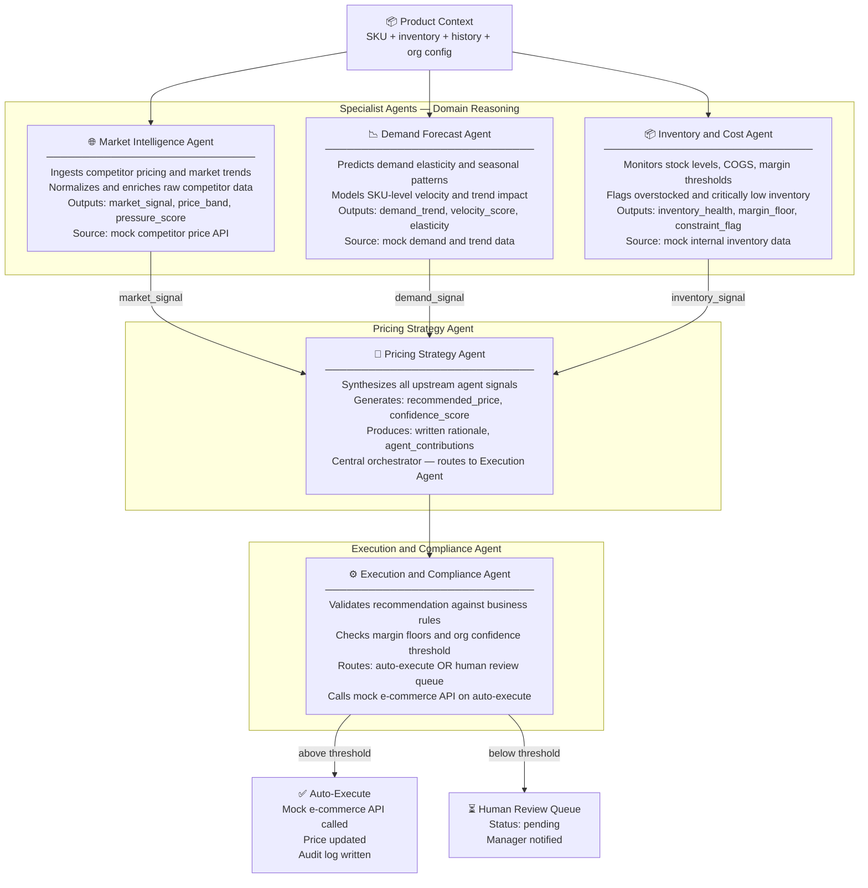
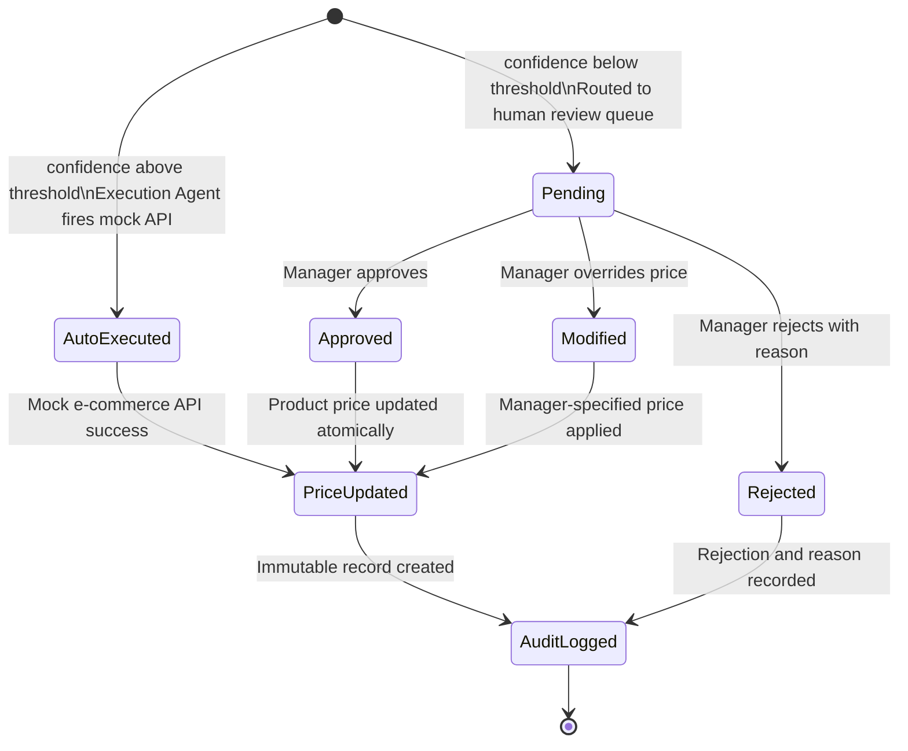
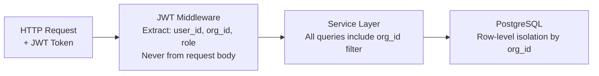
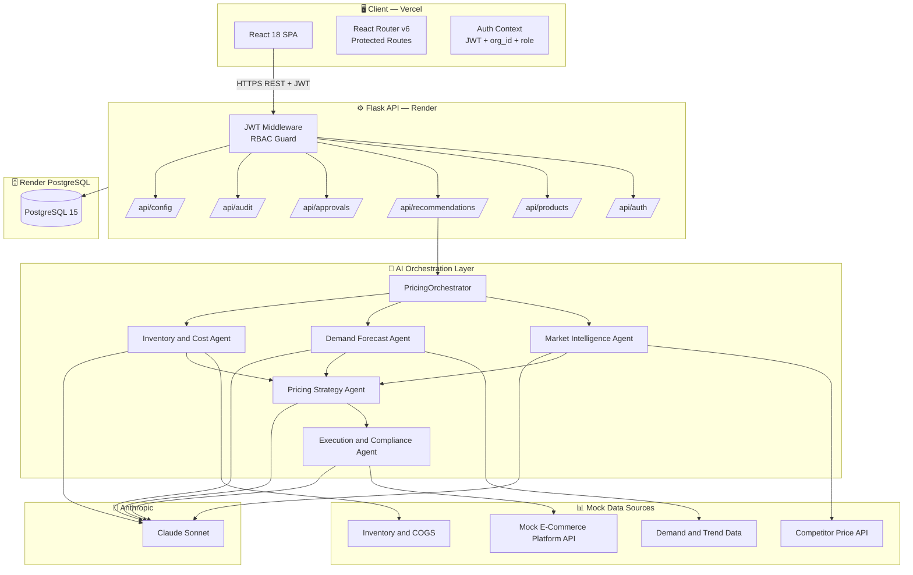
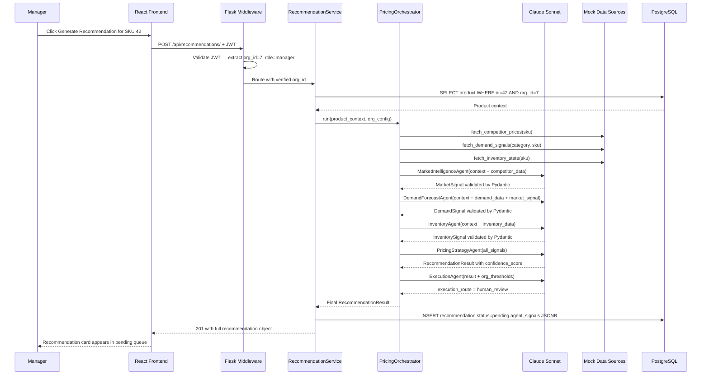
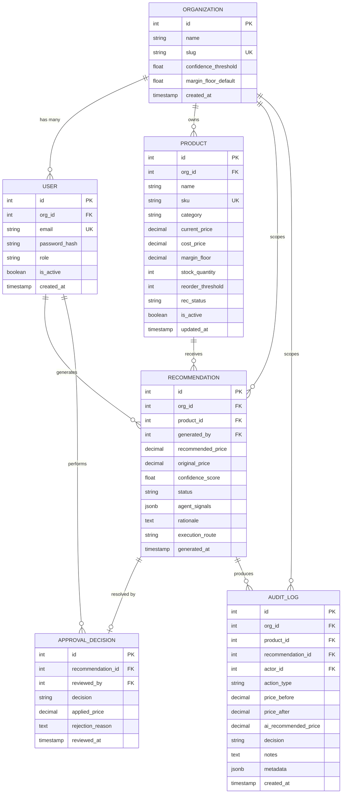

<div align="center">

# 🧠 Dynamic Pricing Intelligence Dashboard

###  Applied AI Intern Technical Assessment Submission*

> **An operational multi-agent AI decision-support platform** that monitors market conditions, generates explainable pricing recommendations with confidence scores, and enforces a human-in-the-loop approval workflow — built end-to-end in 5 days.

<br/>

[](https://dynamic-pricing-intelligence-platfo.vercel.app/login)
[](https://github.com/parthTyagi-tech/dynamic-pricing-intelligence-platform.git)

<br/>


<br/>

> ⚠️ **This is not a chatbot.** It is a structured AI decision system — four specialized agents collaborate, produce a confidence-scored recommendation with full rationale, and route it through a human approval workflow before any price change executes.

</div>

---

## 📋 Table of Contents

- [Why I Chose Option B](#-why-i-chose-option-b)
- [The Business Problem](#-the-business-problem)
- [What I Built](#-what-i-built)
- [Assessment Requirements Coverage](#-assessment-requirements-coverage)
- [Multi-Agent AI Architecture](#-multi-agent-ai-architecture)
- [Human-in-the-Loop Workflow](#-human-in-the-loop-workflow)
- [Multi-Tenant Architecture](#-multi-tenant-architecture)
- [System Architecture](#-system-architecture)
- [Database Schema](#-database-schema)
- [Tech Stack and Rationale](#-tech-stack-and-rationale)
- [Screenshots](#-screenshots)
- [Live Demo](#-live-demo)
- [Setup Instructions](#-setup-instructions)
- [API Reference](#-api-reference)
- [Environment Variables](#-environment-variables)
- [Known Limitations](#-known-limitations)
- [DECISIONS.md Summary](#-decisionsmd-summary)

---

## 🎯 Why I Chose this 

I chose the **Dynamic Pricing Intelligence Dashboard** because it directly exercises the intersection of skills I want to develop: multi-agent AI system design, business workflow automation, and governance-first product thinking.

Option B demanded a real multi-agent architecture — not a single prompt chain dressed up as agents. Each agent has a distinct domain, distinct inputs, and a defined output contract. The human approval workflow forced me to think about AI as a tool that must *earn* operational trust before modifying production data. That's the kind of applied AI engineering that reflects how real AI systems are built and deployed responsibly.

---

## 🔴 The Business Problem

The assessment scenario is real: a mid-size e-commerce company selling 500+ SKUs reprices manually on a weekly spreadsheet cycle. The documented consequences:

| Problem | Quantified Impact |
|---|---|
| Slow response to competitor price changes | **8–12% estimated revenue leakage** |
| Static pricing misses demand surges | Seasonal and viral opportunities uncaptured |
| Overstocking with no pricing response | Forced markdowns and margin erosion |
| Analysts doing data gathering, not analysis | **70%+ of analyst time** on non-strategic work |

The fix is not automation for its own sake. It is AI that surfaces the right recommendation with full reasoning, then lets a human make the call. That is what Klypup delivers.

---

## 💡 What I Built

A full-stack web application covering every requirement in the assessment:

- ✅ JWT Authentication — signup, login, logout, protected routes, no hardcoded credentials
- ✅ Two roles: `admin` (catalog management, threshold config) and `manager` (recommendation review, approvals)
- ✅ Multi-tenant isolation — organizations cannot see each other's data, enforced at the database query layer
- ✅ Product Catalog Dashboard — filterable and sortable SKU list with live recommendation status badges
- ✅ Multi-Agent AI Engine — 5 specialized agents (Market Intelligence, Demand Forecast, Inventory and Cost, Pricing Strategy, Execution and Compliance) that collaborate to produce a structured recommendation
- ✅ Confidence Scoring — each recommendation carries a 0.0–1.0 confidence score with per-agent breakdown
- ✅ Explainability Panel — every recommendation shows what each agent contributed, what data source fed it, and why this price was chosen
- ✅ Human-in-the-Loop Approval Workflow — pending → review → approve / reject / modify → price update → audit log
- ✅ Audit Trail — immutable, timestamped record of every pricing decision with reviewer identity
- ✅ Configurable confidence threshold — admin sets the threshold above which changes auto-execute
- ✅ Competitor Price Mock Data — realistic price simulation with generation script
- ✅ Demand and Inventory Mock Data — seasonal patterns, SKU velocity, stock levels, COGS
- ✅ Mock E-Commerce Platform API — simulated execution endpoint with rollback logic
- ✅ Seed data script — evaluator runs `python seed.py` and sees populated data immediately
- ✅ Live deployment — Vercel (frontend) and Render (backend and managed PostgreSQL)

---

## ✅ Assessment Requirements Coverage

### Option B — Application Requirements

| Requirement (from spec) | Status | Implementation |
|---|---|---|
| Auth with Admin and Pricing Analyst roles | ✅ | JWT with `admin` and `manager` roles; route-level enforcement |
| Product Catalog Dashboard with filter, sort, search | ✅ | Filter by category and status; sort by price, margin, rec status |
| AI Pricing Engine — multi-agent | ✅ | 5 agents with Pydantic-validated I/O contracts |
| Recommendation Detail View — full reasoning | ✅ | Per-agent breakdown, confidence weights, data source attribution |
| Approval Workflow — approve, reject with reason, modify price | ✅ | All three actions implemented; modification stores AI price vs. applied price |
| Confidence threshold — configurable auto-execute | ✅ | Admin config panel; Execution Agent routes based on org threshold |
| Audit Trail — filterable, searchable | ✅ | Full decision log with reviewer, timestamps, before/after prices |
| Competitor Price Data | ✅ | Mock scraper with generation script producing realistic patterns |
| Demand and Trend Signals | ✅ | Seasonal patterns, category trends, individual SKU velocity |
| Inventory and Cost Data | ✅ | Stock levels, COGS, margin thresholds, reorder flags |
| Mock E-Commerce Platform API | ✅ | Simulated execution with success and failure handling and rollback |

### Common Requirements (Section 3 of Assessment)

| Requirement | Status | Notes |
|---|---|---|
| Working auth — no fake logins | ✅ | Real bcrypt password hashing; JWT signed with secret |
| Persistent database — survives restarts | ✅ | PostgreSQL on Render managed instance |
| Clean REST API with error handling and status codes | ✅ | Consistent JSON envelope; 4xx and 5xx with error messages |
| Functional frontend with loading, error, and empty states | ✅ | All three states handled per page |
| CRUD on core data | ✅ | Products (admin); recommendations; approval decisions |
| Responsive design | ✅ | Desktop-first; mobile-responsive layout |
| Multi-tenant data isolation | ✅ | `org_id` enforced at service layer; never accepted from request body |
| RBAC with 2+ roles | ✅ | `admin` and `manager`; enforced by Python decorators on routes |
| Tenant context in every API request | ✅ | JWT carries `org_id`; middleware extracts and injects into every handler |
| LLM integration with tool orchestration | ✅ | Claude Sonnet with structured agent calls |
| Structured output rendered as UI components | ✅ | Agent signals render as cards; confidence as visual indicator |
| Source attribution on every AI insight | ✅ | Each signal shows which mock data source fed it |
| Graceful LLM error handling | ✅ | Fallback states; timeout handling; app does not crash on API failure |
| `.env.example` with documented variables | ✅ | In both `backend/` and `frontend/` |
| Seed data script | ✅ | `python seed.py` — creates 2 orgs, users, 20 products, mock data |
| Live deployment | ✅ | Vercel + Render |

---

## 🧠 Multi-Agent AI Architecture

The AI layer is the core technical differentiator of this system. It is not a single monolithic prompt. Five specialized agents run in a structured sequence, each with defined inputs and outputs validated by Pydantic models.

### Agent Orchestration Flow



### Why Multi-Agent Separation?

A single prompt could theoretically produce a pricing recommendation. Separate agents give us:

1. **Traceable reasoning** — which agent drove the recommendation is visible in the explainability panel
2. **Independent confidence scoring** — each agent contributes its own confidence weight to the composite score
3. **Modular replaceability** — the demand agent could be swapped for a real ML time-series model without touching other agents
4. **Accurate production mapping** — this architecture reflects how production multi-agent systems are actually designed

### Agent I/O Contracts

Every agent exchanges structured, validated data. No freeform text passes between agents.

```python
class MarketSignal(BaseModel):
    signal_type: Literal["below_market", "at_market", "above_market"]
    price_band: tuple[float, float]
    pressure_score: float          # 0.0 = no pressure, 1.0 = extreme
    competitor_count: int
    confidence: float

class DemandSignal(BaseModel):
    trend: Literal["increasing", "stable", "decreasing"]
    velocity_score: float
    seasonality_factor: float
    confidence: float

class InventorySignal(BaseModel):
    health: Literal["overstocked", "healthy", "tightening", "critical"]
    days_of_supply: int
    margin_floor: float
    constraint_flag: bool
    confidence: float

class RecommendationResult(BaseModel):
    recommended_price: float
    confidence_score: float        # Weighted composite of all agent confidences
    rationale: str                 # Human-readable explanation for the UI
    agent_contributions: dict      # Stored as JSONB for the explainability panel
    execution_route: Literal["auto_execute", "human_review"]
```

### Confidence Score Calculation

```
confidence_score = (
    market_signal.confidence    x 0.30  +
    demand_signal.confidence    x 0.35  +
    inventory_signal.confidence x 0.20  +
    strategy_alignment_score    x 0.15
)

Execution Agent routing:
  confidence >= org.confidence_threshold  →  auto-execute
  confidence <  org.confidence_threshold  →  human review queue
```

---

## 👤 Human-in-the-Loop Workflow

Every recommendation below the admin-configured confidence threshold enters a mandatory human review queue. No AI output modifies product prices without explicit human action.

### Workflow State Machine



### Manager Actions in the Approval Queue

| Action | What Happens | Stored in Audit Log |
|---|---|---|
| **Approve** | Product price set to AI recommended price | action, price_before, price_after, reviewer, timestamp |
| **Reject** | Recommendation closed; reason required | action, rejection_reason, reviewer, timestamp |
| **Modify and Approve** | Manager overrides price; that price is applied | action, ai_recommended_price, applied_price, reviewer, timestamp |

The modify action is architecturally important — it means the audit log always captures both what AI recommended and what was actually executed, enabling post-hoc analysis of human override patterns.

---

## 🏢 Multi-Tenant Architecture

Multi-tenancy is enforced as an architectural constraint at the database query layer, not in the UI.

### Isolation Pattern



### Implementation

```python
# org_id is ALWAYS extracted from the verified JWT — never from the client request
@jwt_required()
def get_current_org_id() -> int:
    claims = get_jwt_identity()
    return claims['org_id']

# Every service method receives org_id from middleware injection
def get_products(org_id: int) -> list[Product]:
    return Product.query.filter_by(
        org_id=org_id,
        is_active=True
    ).all()
    # Org B data is structurally unreachable from a valid Org A token
```

Cross-tenant data access is structurally impossible: an Org A token cannot be used to query Org B data because `org_id` is signed into the JWT at login time by the server, never accepted from user-controlled input.

### RBAC Permissions

| Capability | `admin` | `manager` |
|---|---|---|
| View product catalog | ✅ | ✅ |
| Create and edit products | ✅ | ✗ |
| Generate AI recommendations | ✅ | ✅ |
| View recommendation detail and explainability | ✅ | ✅ |
| Approve, reject, or modify recommendations | ✅ | ✅ |
| View audit log | ✅ | ✅ |
| Configure confidence threshold and margin floors | ✅ | ✗ |
| Manage organization users | ✅ | ✗ |

RBAC is enforced by Python decorators on backend route handlers. Frontend role-gating is UX only; the API is the authoritative enforcement layer.

---

## 🏗️ System Architecture

### High-Level Diagram



### Request Lifecycle — Recommendation Generation



---

## 🗄️ Database Schema

### Entity Relationship Diagram



### Why PostgreSQL?

The approval + price update + audit log operation must execute atomically. If the price update succeeds but the audit write fails, the database must roll back — PostgreSQL's ACID guarantees make this reliable without custom recovery logic. JSONB columns on `agent_signals` and `metadata` give the AI layer output schema flexibility while keeping the rest of the model relational and integrity-enforced.

---

## 🛠️ Tech Stack and Rationale

### Frontend
| Technology | Why Chosen |
|---|---|
| React 18 | Composable components suit a data-dense operational dashboard |
| React Router v6 | Protected route wrappers with role-aware redirect logic |
| Axios | Centralized HTTP client; JWT injected via request interceptor |
| Vite 5 | Fast dev loop; static build deploys trivially to Vercel CDN |

**Why not Next.js?** Klypup is an auth-gated operational tool. Every page requires login. SSR adds deployment complexity with zero SEO or performance benefit for this use case.

### Backend
| Technology | Why Chosen |
|---|---|
| Python 3.11 | First-class Anthropic SDK; strong data validation ecosystem |
| Flask 3 | Minimal surface area; Blueprint structure maps cleanly to domain boundaries |
| Flask-JWT-Extended | JWT with custom claims (org_id, role) out of the box |
| Flask-SQLAlchemy | ORM with clean multi-tenant query patterns |
| Pydantic v2 | Agent I/O contract validation between orchestrator layers |
| Gunicorn | Production WSGI server |

**Why Flask over FastAPI?** Flask's decorator-based routing is readable and the Blueprint system maps directly to the domain. FastAPI would be the correct upgrade for async agent execution in production.

### AI and Orchestration
| Technology | Role |
|---|---|
| Anthropic Claude Sonnet | LLM backbone for all 5 agents |
| Anthropic Python SDK | Structured agent API calls |
| Custom PricingOrchestrator | Sequential multi-agent coordination with data handoff |
| Pydantic models | Validated, typed contracts between agents |

### Infrastructure
| Technology | Role |
|---|---|
| PostgreSQL 15 | Primary relational database |
| Render Managed PostgreSQL | Production database hosting |
| Vercel | Frontend CDN hosting with automatic deployments |
| Render Web Service | Backend API hosting |

---

## 📸 Screenshots

> The running application — all claimed features verified visually.

### Product Catalog Dashboard
 SKU list with current price, recommendation status badges, inventory health indicators, and margin display

 
 <br><br>


### AI Recommendation Generation
 Triggering multi-agent orchestration and receiving a confidence-scored recommendation with rationale


<br><br>


### Explainability Panel — Agent Breakdown
 Per-agent signal cards showing market pressure, demand trend, inventory health, source attribution, and per-agent confidence


<br><br>


### Approval Queue — Manager View
Pending recommendations sorted by confidence with approve, reject, and modify action controls

<br><br>


 
---

## 🎬 Live Demo

<div align="center">

[](https://dynamic-pricing-intelligence-platfo.vercel.app/login)


</div>

### Demo Credentials

**Organization A — Acme Electronics**
```
Admin:    admin@acme.com    /  acme-admin-2024
Manager:  manager@acme.com  /  acme-mgr-2024
```

**Organization B — Bravo Home Goods** *(for multi-tenant isolation demo)*
```
Admin:    admin@bravo.com    /  bravo-admin-2024
Manager:  manager@bravo.com  /  bravo-mgr-2024
```

### Recommended Demo Sequence (15-minute walkthrough)

| Step | Time | What to Show | Evaluator Criterion Hit |
|---|---|---|---|
| Login as Org A Admin | 1 min | JWT auth flow, role display, org name in header | Auth, RBAC |
| Product Catalog | 2 min | SKU list, filter by category, recommendation status badges | Full-stack, CRUD |
| Generate Recommendation | 3 min | Trigger orchestration, watch agents run, result reveals with confidence | AI Integration |
| Explainability Panel | 2 min | Open agent breakdown — market, demand, inventory signals with sources | AI Integration, source attribution |
| Approval Queue as Manager | 2 min | Approve one, modify one price, reject one with reason | Human-in-the-loop |
| Audit Log | 1 min | Show all three decisions recorded with AI price vs applied price | Audit trail |
| Switch to Org B | 2 min | Login as Org B — zero Org A data visible | Multi-tenancy |
| Admin Config Panel | 1 min | Adjust confidence threshold, show auto-execute toggle | Architecture depth |

---

## 🚀 Setup Instructions

> These instructions are tested on a clean machine. Follow them in order.

### Prerequisites

- Python 3.11 or higher
- Node.js 18 or higher
- PostgreSQL 15 (local) or use the Render managed instance via `DATABASE_URL`
- Anthropic API key (free tier sufficient for demo volume)

### 1. Clone the Repository

bash
git clone https://github.com/yourusername/klypup.git
cd klypup
```

### 2. Backend Setup

bash
cd backend

# Create and activate virtual environment
python -m venv venv
source venv/bin/activate        # Windows: venv\Scripts\activate

# Install dependencies
pip install -r requirements.txt

# Configure environment variables
cp .env.example .env
# Edit .env — minimum required: DATABASE_URL, JWT_SECRET_KEY, ANTHROPIC_API_KEY

# Run database migrations
flask db upgrade

# Seed demo data — creates 2 orgs, 4 users, 20 products, mock competitor data
python seed.py

# Start backend server
flask run --port 5000
```

### 3. Frontend Setup

bash
cd ../frontend

# Install dependencies
npm install

# Configure environment
cp .env.example .env.local
# Set VITE_API_URL=http://localhost:5000

# Start frontend dev server
npm run dev
# App running at http://localhost:5173


### 4. Verify

Open http://localhost:5173 and log in with the seeded credentials. You should see the product catalog with demo data populated immediately.

### Docker — One-Command Setup (Bonus)

```bash
# From project root
docker compose up --build
# Frontend:  http://localhost:5173
# Backend:   http://localhost:5000
# Database:  localhost:5432
```

---

## 📡 API Reference

### Authentication Header

All protected endpoints require:

Authorization: Bearer <jwt_token>


Token payload: `user_id`, `org_id`, `role`, `exp`

### Endpoints

**Auth**

| Method | Endpoint | Auth | Description |
|---|---|---|---|
| POST | /api/auth/register | None | Create organization and admin user |
| POST | /api/auth/login | None | Authenticate and receive JWT |
| GET | /api/auth/me | Required | Current user and org info |

**Products**

| Method | Endpoint | Auth | Role | Description |
|---|---|---|---|---|
| GET | /api/products/ | Required | Any | List org products with filters |
| POST | /api/products/ | Required | Admin | Create product |
| PUT | /api/products/:id | Required | Admin | Update product |
| DELETE | /api/products/:id | Required | Admin | Soft-delete product |

**Recommendations**

| Method | Endpoint | Auth | Role | Description |
|---|---|---|---|---|
| POST | /api/recommendations/ | Required | Manager+ | Trigger multi-agent recommendation |
| GET | /api/recommendations/ | Required | Any | List recommendations |
| GET | /api/recommendations/:id | Required | Any | Detail view with full agent breakdown |

**Approvals**

| Method | Endpoint | Auth | Role | Description |
|---|---|---|---|---|
| GET | /api/approvals/pending | Required | Manager+ | Pending review queue |
| POST | /api/approvals/:id/approve | Required | Manager+ | Approve recommendation |
| POST | /api/approvals/:id/reject | Required | Manager+ | Reject with required reason |
| POST | /api/approvals/:id/modify | Required | Manager+ | Override price and approve |

**Audit**

| Method | Endpoint | Auth | Role | Description |
|---|---|---|---|---|
| GET | /api/audit/ | Required | Manager+ | Full audit log — filterable |

**Config (Admin Only)**

| Method | Endpoint | Auth | Role | Description |
|---|---|---|---|---|
| GET | /api/config/ | Required | Admin | Get org thresholds and rules |
| PUT | /api/config/ | Required | Admin | Update threshold and margin floors |

### Example Requests and Responses

**Generate Recommendation**

```http
POST /api/recommendations/
Authorization: Bearer eyJhbGc...
Content-Type: application/json

{ "product_id": 42 }
```

```json
{
  "id": 107,
  "product_id": 42,
  "product_name": "Sony WH-1000XM5",
  "recommended_price": 279.99,
  "original_price": 299.99,
  "confidence_score": 0.61,
  "execution_route": "human_review",
  "status": "pending",
  "rationale": "Competitor dropped price 15%. Demand is trending upward but inventory is overstocked at 42 days of supply. Recommend a moderate price reduction to stay competitive while clearing stock. Confidence below org threshold — routed to human review.",
  "agent_signals": {
    "market_intelligence": {
      "signal_type": "above_market",
      "price_band": [269.99, 289.99],
      "pressure_score": 0.72,
      "confidence": 0.85
    },
    "demand_forecast": {
      "trend": "increasing",
      "velocity_score": 0.64,
      "confidence": 0.58
    },
    "inventory_analysis": {
      "health": "overstocked",
      "days_of_supply": 42,
      "margin_floor": 219.99,
      "confidence": 0.90
    }
  },
  "generated_at": "2025-08-14T10:32:07Z"
}
```

**Modify and Approve**

```http
POST /api/approvals/107/modify
Authorization: Bearer eyJhbGc...

{
  "applied_price": 284.99,
  "notes": "AI suggested 279.99 but margin floor risk. Setting 284.99."
}
```

```json
{
  "decision": "modified",
  "ai_recommended_price": 279.99,
  "applied_price": 284.99,
  "ecommerce_api_status": "success",
  "audit_log_id": 301,
  "reviewed_at": "2025-08-14T10:41:18Z"
}
```

---


## ⚠️ Known Limitations

Documented honestly per assessment requirements.

| Limitation | Impact | Fix in Production |
|---|---|---|
| Synchronous AI orchestration | Recommendation generation blocks the request thread for 3–6 seconds | Celery + Redis for async agent execution; frontend polls for completion |
| Mock data sources only | No real competitor price APIs or Google Trends integrated | Integrate real scraping APIs; connect pytrends for demand signals |
| No JWT refresh tokens | Sessions expire after 24 hours with no silent refresh | Add refresh token rotation with sliding window |
| Render free-tier cold starts | First request after inactivity takes ~30 seconds | Upgrade to paid tier or implement health check keep-alive |
| No streaming AI responses | User waits for full orchestration before seeing any output | Add SSE streaming for per-agent progress updates in the UI |
| No unit tests | Core service and orchestrator logic untested | Add pytest suite covering orchestrator, service layer, and agent contracts |
| No Docker Compose | Local setup requires manual steps for backend and frontend | Docker Compose with one-command startup — next priority |

---

## 📝 DECISIONS.md Summary

> Full `DECISIONS.md` is in the repository root. Key decisions summarized here.

**Why Option B?**
Multi-agent system design, approval workflow governance, and business pricing logic — this is applied AI engineering with real operational stakes, which is more interesting and more representative of production AI systems than a research query interface.

**Why Flask and React?**
Flask's Blueprint architecture maps cleanly to the domain's service boundaries. React gives component-level state management suitable for a data-dense dashboard without the SSR overhead of Next.js, which adds nothing for an auth-gated tool.

**Why PostgreSQL over MongoDB?**
The approve + update price + write audit operation must be atomic. ACID transactions are a hard requirement, not a nice-to-have. JSONB columns handle the flexible `agent_signals` field without sacrificing relational integrity for the rest of the schema.

**Why separate agents instead of one large prompt?**
Per-agent confidence scoring, traceable reasoning visible in the explainability panel, and modular replaceability. The explainability panel is only possible because each agent's contribution is captured and stored separately in the JSONB column.

**Biggest tradeoff made in 5 days:**
Synchronous agent orchestration instead of async. It works, it is demoable, and it is the correct first thing to replace on the path to production.

**What I would improve with 2 more weeks:**
Async Celery workers for agent execution, real competitor price scraping integration, JWT refresh tokens, pytest coverage for the service layer and agent contracts, Docker Compose for one-command setup, and SSE streaming for live agent progress updates.

**Hardest part:**
Designing the agent I/O contracts so each agent produces structured, validated output that the next agent can consume reliably — without making the orchestrator a fragile pipeline that breaks when LLM output varies slightly. Pydantic validation with fallback defaults on the Pricing Strategy Agent solved this.

---

<div align="center">


*Multi-agent architecture · Human-in-the-loop governance · Multi-tenant isolation · End-to-end in 5 days*

<br/>

[](https://dynamic-pricing-intelligence-platfo.vercel.app/login)
[](https://github.com/parthTyagi-tech/dynamic-pricing-intelligence-platform.git)

</div>
