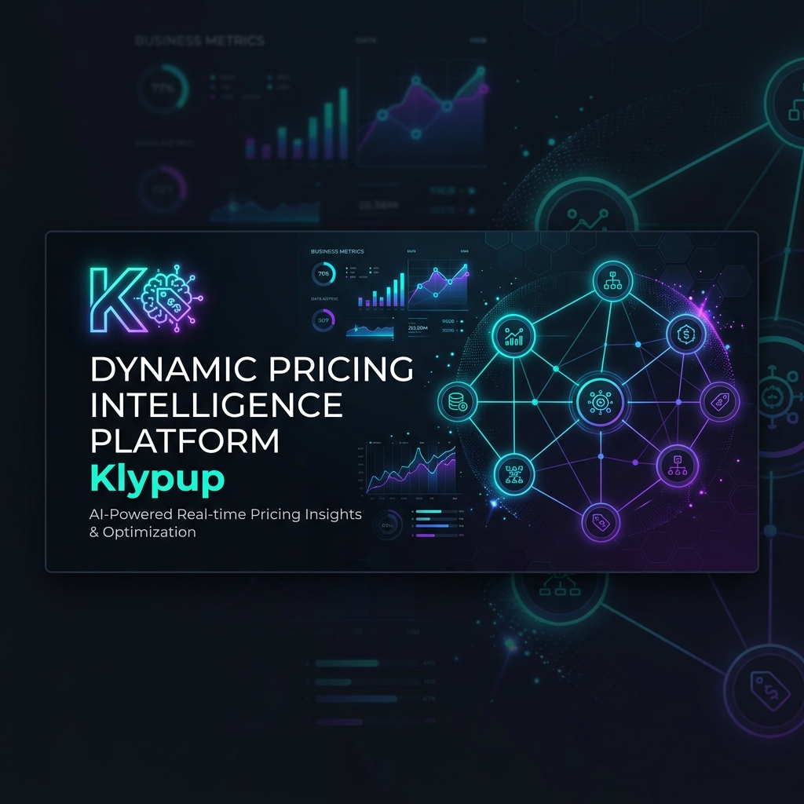
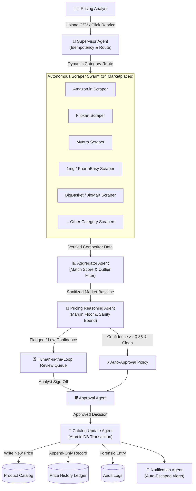
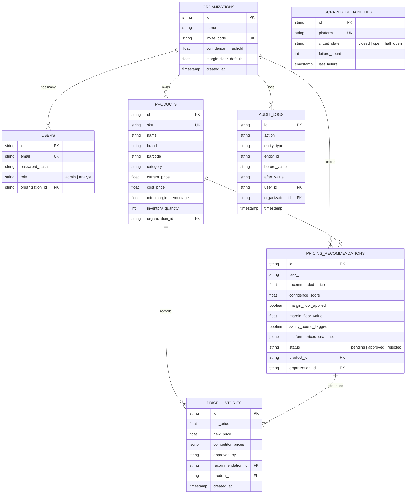

<div align="center">



# 🧠 Dynamic Pricing Intelligence Platform (v2)
### *Fully Agentic Multi-Platform Live Price Recommendation & Governance System*

> **An enterprise-grade, autonomous multi-agent intelligence platform** designed for offline-catalog and multi-channel e-commerce merchants. Orchestrates autonomous agents that plan, scrape live competitor marketplaces, observe signals, adapt to anti-bot defenses, enforce hard code-level margin floors, and provide full human-in-the-loop governance.

<br/>

[](https://github.com/parthTyagi-tech/dynamic-pricing-intelligence-platform.git)
[](https://dynamic-pricing-intelligence-platfo.vercel.app/login)

<br/>


<br/>

> ⚡ **Agentic, Not a Script:** Unlike hardcoded sequential pipelines, every agent in this platform has its own discrete goal, toolset, working memory, and autonomous `Plan → Act → Observe → Evaluate → Adapt` loop. Scrapers adapt to blocks, aggregators quarantine unverified matches, and reasoning agents adjust confidence dynamically.

</div>

---

## 📋 Table of Contents

- [Core Principles & Architectural Philosophy](#-core-principles--architectural-philosophy)
- [Autonomous Multi-Agent Swarm](#-autonomous-multi-agent-swarm)
- [Product Category to Marketplace Routing](#-product-category-to-marketplace-routing)
- [Security Guardrails & Hardening (SEC-1 to SEC-16)](#-security-guardrails--hardening-sec-1-to-sec-16)
- [System Architecture & Event Topology](#-system-architecture--event-topology)
- [Interactive Visual Decision Trace UI](#-interactive-visual-decision-trace-UI)
- [Database Schema & Relational Integrity](#-database-schema--relational-integrity)
- [API Sandbox & Payload Catalog](#-api-sandbox--payload-catalog)
- [Quick Start Guide (Local & Docker)](#-quick-start-guide-local--docker)
- [GCP Cloud Deployment Architecture](#-gcp-cloud-deployment-architecture)
- [Verification & Automated Test Suite](#-verification--automated-test-suite)
- [Production Roadmap](#-production-roadmap)

---

## ⚡ Core Principles & Architectural Philosophy

Mid-sized merchants with 500+ SKUs typically operate with offline product catalogs (CSV/ERP exports) and manually reprice on weekly spreadsheets. This results in **revenue leakage (8–12%)**, delayed responses to competitor promotions, and deep clearance markdowns that crush margins.

Klypup solves this with **Genuine Multi-Agent Architecture**:
1. **Dynamic Decision Making**: Agents don't simply execute hardcoded DAGs. If an e-commerce platform blocks requests, the scraper shifts strategies (rotating proxies $\rightarrow$ headless browser automation $\rightarrow$ query token relaxation) or cleanly trips a circuit breaker.
2. **Code-Level Financial Guardrails**: The pricing reasoning agent's recommendation is constrained by a hard-coded code-level margin floor. LLMs cannot hallucinate or suggest prices below `cost_price * (1 + min_margin_percentage / 100)`.
3. **Product-Match Confidence Scoring**: Candidate items are verified via Jaccard token overlap, mandatory brand checks, and barcode matching. Matches scoring $< 0.65$ are quarantined from calculation.
4. **Zero-Trust Multi-Tenancy**: Every database query, background task, and Server-Sent Events (SSE) stream enforces tenant scoping derived strictly from cryptographic JWT claims.

---

## 🤖 Autonomous Multi-Agent Swarm


```mermaid
graph TD
    User["👨‍💼 Pricing Analyst"] -->|Upload CSV / Click Reprice| Sup["🎯 Supervisor Agent<br/>(Idempotency & Route)"]
    
    subgraph Swarm["Autonomous Scraper Swarm (14 Marketplaces)"]
        S1["Amazon.in Scraper"]
        S2["Flipkart Scraper"]
        S3["Myntra Scraper"]
        S4["1mg / PharmEasy Scraper"]
        S5["BigBasket / JioMart Scraper"]
        S6["... Other Category Scrapers"]
    end

    Sup -->|Dynamic Category Route| Swarm
    Swarm -->|Verified Competitor Data| Agg["📊 Aggregator Agent<br/>(Match Score & Outlier Filter)"]
    Agg -->|Sanitized Market Baseline| Reasoner["🧠 Pricing Reasoning Agent<br/>(Margin Floor & Sanity Bound)"]
    
    Reasoner -->|Confidence >= 0.85 & Clean| AutoApprove["⚡ Auto-Approval Policy"]
    Reasoner -->|Flagged / Low Confidence| ReviewQueue["⏳ Human-in-the-Loop Review Queue"]
    
    ReviewQueue -->|Analyst Sign-Off| Approver["🛡️ Approval Agent"]
    AutoApprove --> Approver
    
    Approver -->|Approved Decision| Catalog["💾 Catalog Update Agent<br/>(Atomic DB Transaction)"]
    Catalog -->|Write New Price| ProductDB[("Product Catalog")]
    Catalog -->|Append-Only Record| PriceLedger[("Price History Ledger")]
    Catalog -->|Forensic Entry| AuditLog[("Audit Logs")]
    
    Catalog --> Notif["📢 Notification Agent<br/>(Auto-Escaped Alerts)"]
```

### Agent Roster Details

| Agent | Responsibility | Autonomous Capabilities & Tools |
|---|---|---|
| **🎯 Supervisor Agent** | Task coordinator & orchestrator | Checks 20-min idempotency cache (Gap #6), inspects circuit breakers (Gap #7), dispatches category scrapers in parallel, and logs decision traces. |
| **🌐 14 Platform Scrapers** | Live marketplace intelligence | 3-tier adaptive fallback: Fast HTTP $\rightarrow$ Headless Browser $\rightarrow$ Query Relaxation. Safe URL encoding for product names. Credential masking (SEC-12). |
| **📊 Aggregator Agent** | Signal synthesis & cleansing | Quarantines `unverified_match` items ($< 0.65$), applies IQR statistical outlier rejection to eliminate spoofed prices, and explicitly attributes missing platforms. |
| **🧠 Pricing Reasoning Agent** | Optimal price generation | Applies hard code-level margin floor clamp (`cost * (1 + margin%)`), checks $\pm 50\%$ price sanity bounds (SEC-10), and proportionally downgrades confidence on partial data. |
| **🛡️ Approval Agent** | Human-in-the-loop governance | Enforces SEC-1/SEC-2 organization ownership, validates transitions, and routes decisions to catalog update or archival. |
| **💾 Catalog Update Agent** | Transactional ledger commit | Executes atomic nested database transactions (SEC-6): updates `Product.current_price`, appends immutable `PriceHistory` (SEC-7), and writes forensic `AuditLog` (SEC-8). |
| **📢 Notification Agent** | Stakeholder alerting | Employs auto-escaped Jinja2 templates (SEC-11) to dispatch alerts without vulnerability to HTML/template injection. |

---

## 🛒 Product Category to Marketplace Routing

The Supervisor dynamically routes products to relevant category platforms, avoiding unnecessary scraping of irrelevant marketplaces:

| Category Code | Platform Targets | Target Marketplaces & Focus |
|---|---|---|
| `electronics` | Amazon.in, Flipkart | Model number, spec tokens, warranty validation |
| `fashion` / `apparel` | Myntra, Ajio | Size/color matrix extraction, sub-brand handling |
| `beauty` / `personal_care`| Nykaa, Purplle | Shade/volume normalization, bundle filtering |
| `grocery` / `daily_essentials`| BigBasket, JioMart | Unit price normalization (per g / ml), geo-pincode |
| `home_goods` / `furniture`| Pepperfry, Urban Ladder | Material, dimension, and assembly verification |
| `pharmacy` / `health` | 1mg, PharmEasy | Salt/molecule matching, packaging unit normalization |
| `jewelry` | CaratLane, Tanishq | Purity (14K/18K/22K), diamond weight, certification |
| `books` / `sports` / `general`| Amazon.in, Flipkart | ISBN matching, author overlap, authentic gear tags |

---

## 🛡️ Security Guardrails & Hardening (SEC-1 to SEC-16)

The platform is engineered under a zero-trust model. Every security requirement is codified and verified through automated test suites:

| ID | Security Guardrail | Enforcement Mechanism & Code Location |
|---|---|---|
| **SEC-1** | Multi-tenant query scoping | All queries filter by `organization_id` extracted from JWT claims. No cross-tenant leaks. |
| **SEC-2** | SSE task streaming isolation | `/task/:id/stream` and `/task/:id/state` reject mismatched `organization_id` with HTTP 403 (`TaskAccessDeniedError`). |
| **SEC-3** | Circuit breaker state protection | Scraper health is tracked in `ScraperReliability`. Open breakers bypass scraping targets automatically. |
| **SEC-4** | CSV formula injection defense | `catalog_ingestion_service.py` prepends `'` to any cell starting with `=`, `+`, `-`, `@`. Caps file uploads at 10MB. |
| **SEC-5** | Prompt injection sanitization | Inputs to reasoning agents strip control characters, delimiter tags, and instruction overrides. |
| **SEC-6** | Database transaction atomicity | Catalog price updates, `PriceHistory`, and `AuditLog` run within atomic nested DB transactions (`begin_nested()`). |
| **SEC-7** | Immutable price history ledger | `PriceHistory` has no update or delete routes; historical price changes are permanently append-only. |
| **SEC-8** | Forensic audit logging | Changes log `user_id`, `task_id`, `before_value`, `after_value`, `ip_address`, and timestamp. |
| **SEC-9** | Output sanitization | Agent responses pass through `sanitize_output()` before event bus broadcast and DB serialization. |
| **SEC-10** | Price sanity bounding | Price swings exceeding $\pm 50\%$ trigger `sanity_bound_flagged = True` and mandate human approval. |
| **SEC-11** | Template injection defense | Auto-escaped Jinja2 environments in `notification_agent.py` sanitize dynamic email/webhook content. |
| **SEC-12** | Proxy credential masking | `ProxyManager` masks proxy credentials in all logging and exception traces (`user:****@host:port`). |
| **SEC-13** | Trigger rate limiting | Route rate-limiting prevents DoS against upstream scraping endpoints (10 requests/min/org). |
| **SEC-14** | Ephemeral event retention | Local event bus keeps a rolling 100-message buffer; GCP Pub/Sub topics configure 24-hour message retention. |
| **SEC-15** | Cloud Secret Manager | Zero plaintext credentials in code. Production pulls secrets from Google Cloud Secret Manager. |
| **SEC-16** | Principle of Least Privilege | IAM service accounts restricted strictly to Pub/Sub publisher/subscriber and Cloud SQL Client roles. |

---

## 🏗️ System Architecture & Event Topology

### Dual Event Bus Architecture
The platform supports two runtime modes without requiring code changes:
1. **Local Development Mode (`EVENT_BUS_PROVIDER=local`)**:
   - Zero external infrastructure required. Runs a thread-safe in-memory pub/sub (`LocalEventBus`) with per-task subscriber isolation and deterministic competitor simulation (`MOCK_SCRAPING=true`).
2. **GCP Enterprise Mode (`EVENT_BUS_PROVIDER=pubsub`)**:
   - Dispatches tasks across Google Cloud Pub/Sub topics (`pricing-tasks-topic`, `pricing-events-topic`), scaling horizontally across Cloud Run microservices.

```
                           [ React 18 / Vite SPA Client ]
                                         │
                                         ▼ (HTTPS / SSE Streaming)
                         [ Flask 3.x API Gateway & Agents ]
                                         │
                     ┌───────────────────┴───────────────────┐
                     ▼                                       ▼
          [ LocalEventBus / GCP PubSub ]            [ PostgreSQL 15 Database ]
          ├── task.dispatched                       ├── Products & Organizations
          ├── scraper.started / completed           ├── PricingRecommendations
          ├── aggregator.completed                  ├── PriceHistory (Append-only)
          ├── pricing.recommended                   ├── ScraperReliability (Circuit)
          └── catalog.updated                       └── AuditLogs (Forensics)
```

---

## 🖥️ Interactive Visual Decision Trace UI

The frontend includes an interactive **Agentic Decision Trace** component ([`AgenticDecisionTrace.tsx`](./frontend/src/components/AgenticDecisionTrace.tsx)):
- **Live SSE Event Stream**: Real-time progress timeline detailing every step the agents take.
- **Guardrail Status Badges**:
  - 🛡️ **Margin Floor Protected**: Displays whether the recommended price was clamped to protect gross margin.
  - ⚠️ **Sanity Bound Check**: Alerts analysts if the price shift exceeds $\pm 50\%$.
- **Verified Competitor Evidence**: Displays matched marketplace URLs, prices, stock statuses, and match confidence scores ($0.0 - 1.0$).
- **One-Click Human Sign-Off**: Directly approve or reject with custom notes from the decision panel.

---

## 🗄️ Database Schema & Relational Integrity


```mermaid
erDiagram
    ORGANIZATIONS {
        string id PK
        string name
        string invite_code UK
        float confidence_threshold
        float margin_floor_default
        timestamp created_at
    }

    USERS {
        string id PK
        string email UK
        string password_hash
        string role "admin | analyst"
        string organization_id FK
    }

    PRODUCTS {
        string id PK
        string sku UK
        string name
        string brand
        string barcode
        string category
        float current_price
        float cost_price
        float min_margin_percentage
        int inventory_quantity
        string organization_id FK
    }

    PRICING_RECOMMENDATIONS {
        string id PK
        string task_id
        float recommended_price
        float confidence_score
        boolean margin_floor_applied
        float margin_floor_value
        boolean sanity_bound_flagged
        jsonb platform_prices_snapshot
        string status "pending | approved | rejected"
        string product_id FK
        string organization_id FK
    }

    PRICE_HISTORIES {
        string id PK
        float old_price
        float new_price
        jsonb competitor_prices
        string approved_by
        string recommendation_id FK
        string product_id FK
        timestamp created_at
    }

    SCRAPER_RELIABILITIES {
        string id PK
        string platform UK
        string circuit_state "closed | open | half_open"
        int failure_count
        timestamp last_failure
    }

    AUDIT_LOGS {
        string id PK
        string action
        string entity_type
        string entity_id
        string before_value
        string after_value
        string user_id FK
        string organization_id FK
        timestamp timestamp
    }

    ORGANIZATIONS ||--o{ USERS : "has many"
    ORGANIZATIONS ||--o{ PRODUCTS : "owns"
    ORGANIZATIONS ||--o{ PRICING_RECOMMENDATIONS : "scopes"
    ORGANIZATIONS ||--o{ AUDIT_LOGS : "logs"
    PRODUCTS ||--o{ PRICING_RECOMMENDATIONS : "receives"
    PRODUCTS ||--o{ PRICE_HISTORIES : "records"
    PRICING_RECOMMENDATIONS ||--o{ PRICE_HISTORIES : "generates"
```

---

## 📡 API Sandbox & Payload Catalog

All tenant routes require: `Authorization: Bearer <jwt_token>`.

### Key Endpoints

| Blueprint | Method | Path | Role | Description |
|---|---|---|---|---|
| **Agentic v2** | `POST` | `/api/recommend/:product_id` | Analyst+ | Dispatches autonomous repricing pipeline (with 20-min idempotency cache). |
| | `GET` | `/api/task/:task_id/stream` | Analyst+ | Server-Sent Events (SSE) live trace stream (SEC-2 scoped). |
| | `GET` | `/api/task/:task_id/state` | Analyst+ | Fetches current task snapshot and decision traces. |
| | `POST` | `/api/task/:task_id/approve` | Analyst+ | Approves recommendation and triggers atomic catalog update. |
| | `POST` | `/api/task/:task_id/reject` | Analyst+ | Rejects recommendation with mandatory reason note. |
| | `GET` | `/api/product/:product_id/price-history` | Analyst+ | Returns immutable, append-only historical price audit ledger. |
| | `POST` | `/api/catalog/upload` | Admin | Ingests catalog CSV with formula injection neutralization (SEC-4). |

---

## 🚀 Quick Start Guide (Local & Docker)

### Option A: Docker Compose (Recommended)
Make sure Docker is running:
```bash
docker compose up --build
```
- **Web UI**: [http://localhost:80](http://localhost:80)
- **API Server**: [http://localhost:5000](http://localhost:5000)
- **Database**: PostgreSQL at `localhost:5432`

---

### Option B: Local Development (Step-by-Step)

#### 1. Backend Setup
```bash
cd backend
python -m venv env

# Windows
.\env\Scripts\activate
# macOS / Linux
source env/bin/activate

pip install -r requirements.txt

# Run migrations & seed catalog
flask db upgrade
python seed.py

# Run API server
flask run --port 5000
```

#### 2. Frontend Setup
```bash
cd frontend
npm install
npm run dev
# Vite runs at http://localhost:5173
```

---

## ☁️ GCP Cloud Deployment Architecture

For high-throughput enterprise deployments on Google Cloud:

```
[ Merchant Web / API ] ──> [ Google Cloud Armor (WAF) ]
                                   │
                                   ▼
                      [ Google Cloud Run (Backend) ]
                                   │
             ┌─────────────────────┴─────────────────────┐
             ▼                                           ▼
  [ Google Cloud Pub/Sub ]                   [ Cloud SQL (PostgreSQL 15) ]
  (Distributed Event Bus)                     (Private IP via VPC Connector)
             │
             ▼
[ Cloud Run Scraper Workers ] ──(NAT)──> [ Residential Proxy Mesh ]
```

1. **Deploy API on Cloud Run**:
   ```bash
   gcloud run deploy pricing-backend \
     --image gcr.io/$PROJECT_ID/pricing-backend:latest \
     --vpc-connector pricing-vpc-conn \
     --set-secrets="DATABASE_URL=pricing-db-secret:latest,JWT_SECRET=jwt-secret:latest" \
     --service-account=pricing-api-sa@$PROJECT_ID.iam.gserviceaccount.com
   ```
2. **Configure Cloud Pub/Sub**:
   ```bash
   gcloud pubsub topics create pricing-events-topic --message-retention-duration=1d
   gcloud pubsub subscriptions create pricing-events-sub --topic=pricing-events-topic --ack-deadline=60
   ```

*Complete GCP step-by-step instructions are available in [`docs/deployment_guide_gcp.md`](./docs/deployment_guide_gcp.md).*

---

## 🧪 Verification & Automated Test Suite

The platform includes an automated pytest suite in `backend/tests/test_agentic_system.py`:

```bash
cd backend
python -m pytest tests/test_agentic_system.py -v
```

### Verified Scenarios (12/12 Passing)
- ✅ `test_event_bus_delivery_and_filtering`: Asserts tenant message isolation on event streams.
- ✅ `test_product_match_scoring`: Validates Jaccard similarity, brand gating, and barcode detection.
- ✅ `test_margin_floor_hard_guardrail`: Confirms code-level margin floor overrides any LLM price.
- ✅ `test_price_sanity_bounds_flagging`: Confirms $> 50\%$ price swings require human sign-off.
- ✅ `test_csv_injection_neutralization`: Confirms CSV formula injection (`=`, `+`, `-`, `@`) is escaped.
- ✅ `test_task_manager_cross_org_access`: Confirms SEC-2 task access control yields HTTP 403 on mismatch.
- ✅ `test_supervisor_circuit_breaker`: Confirms tripped circuits bypass failing scrapers automatically.
- ✅ `test_atomic_approval_and_audit`: Confirms atomic updates and immutable audit logging.
- ✅ `test_prompt_injection_defense`: Confirms malicious prompt directives are neutralized.
- ✅ `test_supervisor_idempotency_cache`: Confirms duplicate runs return cached recommendations within 20-min TTL.
- ✅ `test_search_url_encoding`: Confirms URL query encoding on product names with special symbols/quotes.
- ✅ `test_unknown_platform_no_silent_fallback`: Confirms unknown marketplaces raise `ValueError` without silent cross-platform pollution.

---

## 🎯 Production Roadmap

- [x] **Autonomous Multi-Agent Architecture v2** (Supervisor, 14 Scrapers, Aggregator, Reasoning, Approval, Catalog, Notification).
- [x] **Zero-Trust Security Controls** (SEC-1 through SEC-16 guardrails).
- [x] **Interactive Real-Time Decision Trace UI** with SSE streaming.
- [x] **Code-Enforced Margin Floors & Sanity Bound Checks**.
- [x] **Safe URL Query Encoding & Strict Registry Validation**.
- [ ] **pgvector Semantic Search**: Store past human overrides and rationales as embeddings for few-shot in-context learning.
- [ ] **Multi-Currency Normalization**: Automatic currency conversion (USD, EUR, GBP to INR) for international multi-marketplace comparison.
- [ ] **Dynamic Pricing Schedules**: Cron-based scheduled repricing triggers for viral or perishable inventory lines.

---

<div align="center">

*Engineered with Zero-Trust Security · Powered by Multi-Agent Swarms · Built for High-Growth Commerce*

</div>
